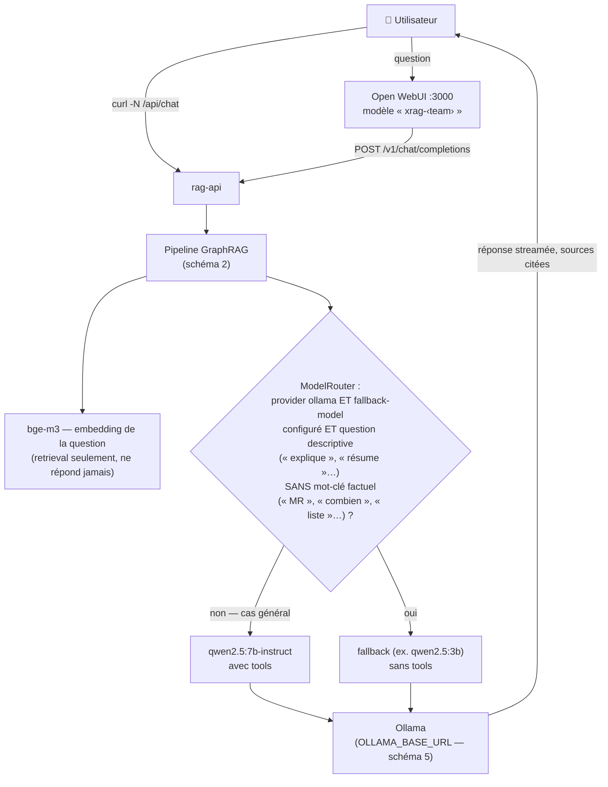
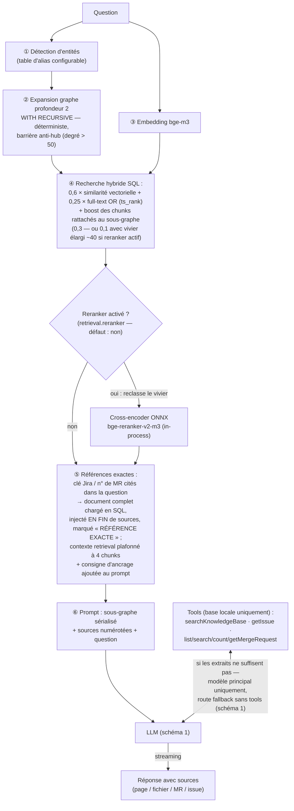
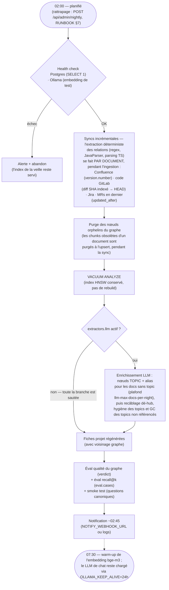
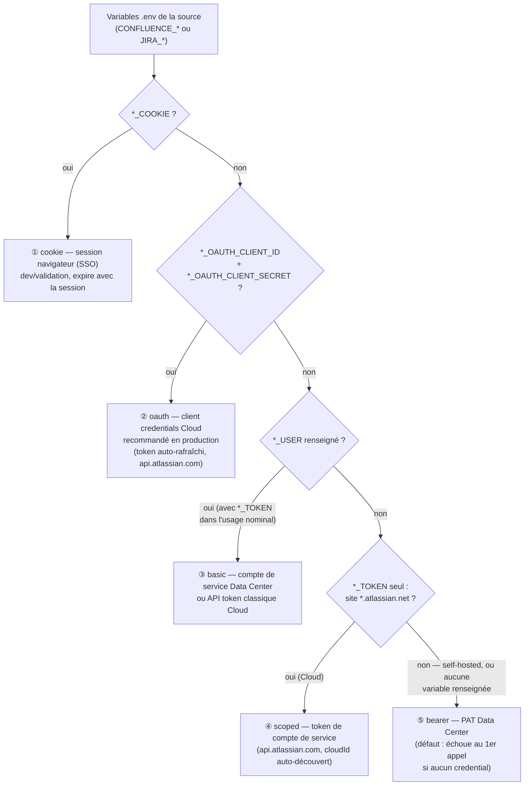
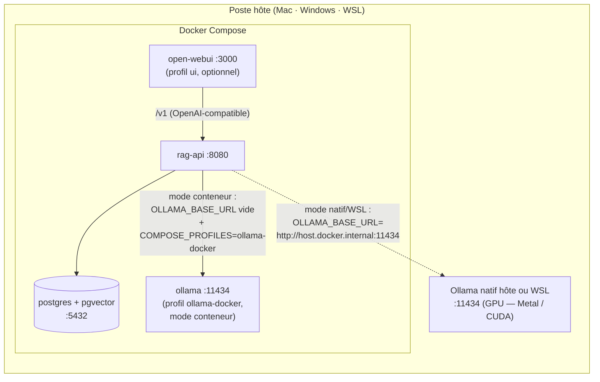
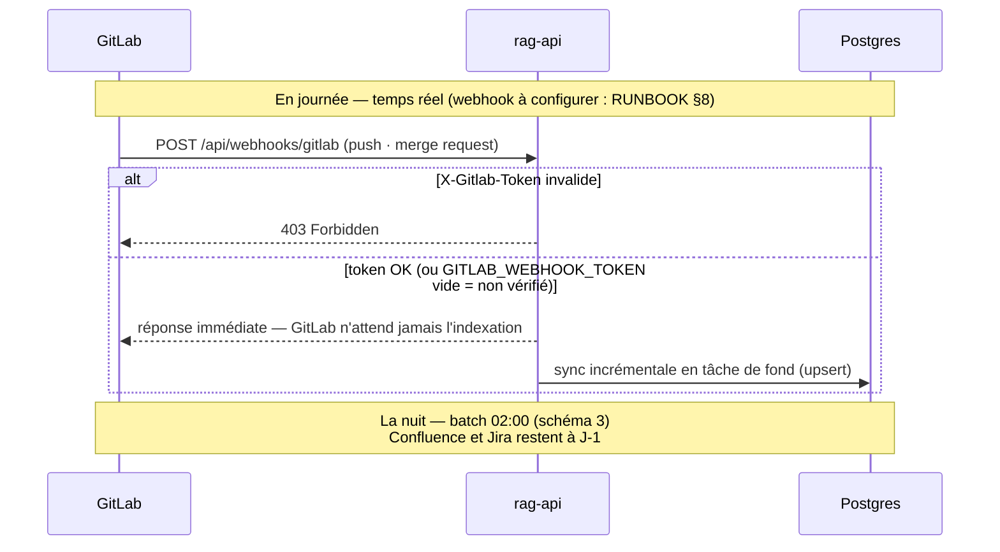

# Workflows — les flux du système en schémas

Vue visuelle des flux clés. Chaque schéma renvoie au document qui fait autorité
(README pour le produit, RUNBOOK pour l'exploitation, CLAUDE.md pour les décisions
d'architecture) — les schémas illustrent, ils ne remplacent pas.

## 1. Quel modèle LLM répond à ma question ?

Le routage vers un fallback exige **deux conditions** : `llm.provider: ollama` **et**
`llm.fallback-model` renseigné dans `team-config.yml`. Sans les deux (défaut recommandé :
pas de fallback), **toutes** les questions vont au modèle principal, avec les tools.

> Schéma pour `llm.provider: ollama` (défaut). En `provider: gemini`, le modèle principal
> est l'API Gemini, le fallback est désactivé même s'il est renseigné — seuls les
> embeddings `bge-m3` restent toujours sur Ollama.

## 2. Pipeline GraphRAG hybride — le chemin d'une question

Le cœur du système (décisions d'architecture n° 5 et 6 de CLAUDE.md) : le graphe
guide la recherche vectorielle, les références exactes court-circuitent la similarité.

## 3. Batch nocturne

Règle d'or : **jamais de destruction d'index** — tout est upsert à clés stables.
Toute exception après le health check déclenche une alerte et laisse l'index déjà
servi intact ; l'échec de sync d'une seule source n'interrompt pas les autres
(statut en erreur dans `sync_state`, le batch continue).

## 4. Résolution de l'authentification Atlassian

Cinq modes, résolus dans cet ordre depuis le `.env` (première condition vraie
retenue) — détail des variables : README « Authentification » et `.env.example`.

## 5. Topologie de déploiement — les trois modes Ollama

Le choix se fait entièrement dans `.env` (`OLLAMA_BASE_URL` + `COMPOSE_PROFILES`),
sans toucher au `docker-compose.yml` — permutation : RUNBOOK §4.

## 6. Fraîcheur des données — temps réel GitLab vs J-1

